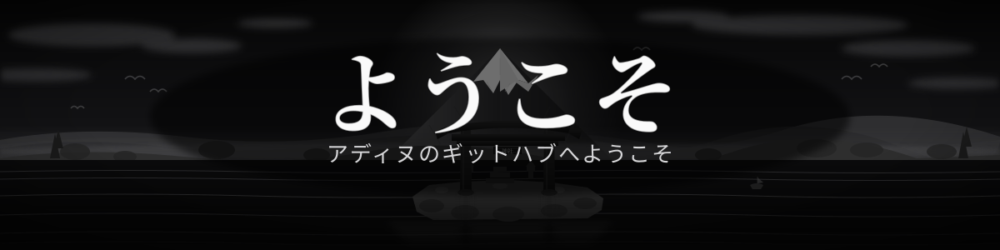

  

 

  

 

---
### Behind the Code

### Hi! I'm ADINU WIRA NUGRAHA

I'm a developer, designer, and curious builder who enjoys turning ideas into useful things. I work across web development, software tools, graphic design, and technology, while continuously learning new skills, including Japanese.

- Studying Systems Engineering
- Building things with JavaScript, React & Bootstrap
- Competing in ICPC 2025
- Currently learning new frameworks

  
  
  
  
  

 

---
### Tech Stack

  

  
  
  
  
  

 

## Statistics

  
  

  

  

 

## Pinned Repositories

<table align="center" width="100%" cellpadding="6" cellspacing="0">
  <tr>
    <td width="50%" align="center">
      
    </td>
    <td width="50%" align="center">
      
    </td>
  </tr>
</table>

 
